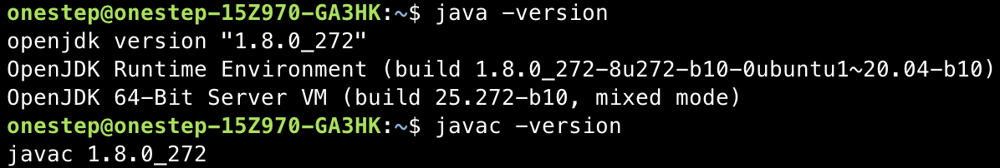
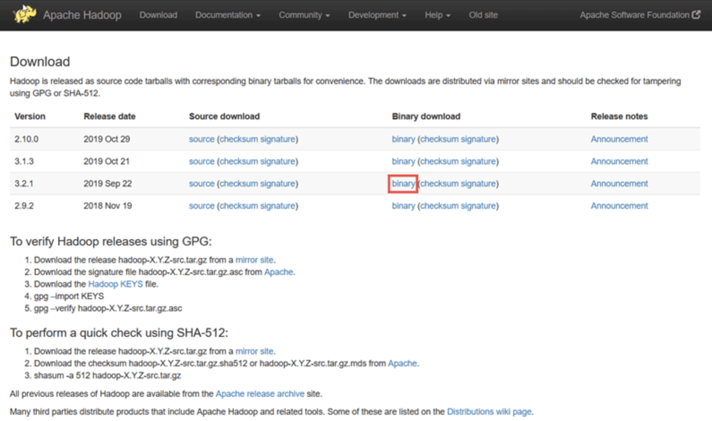
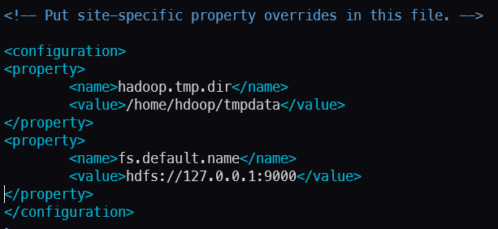
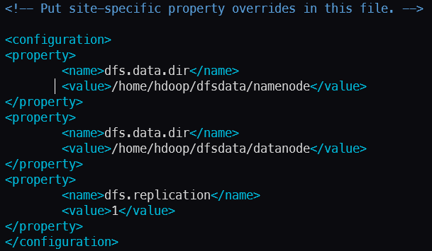
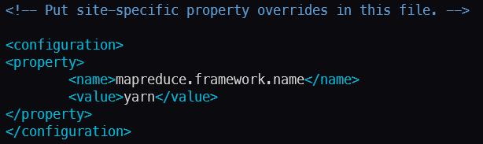
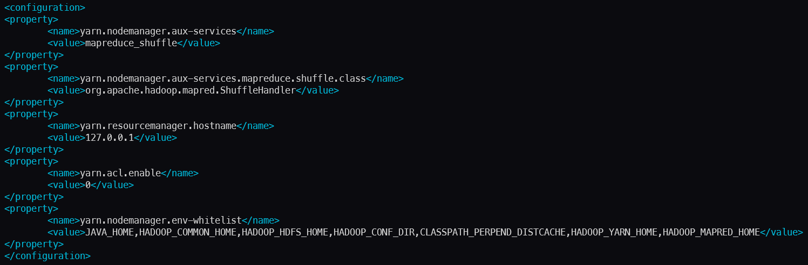
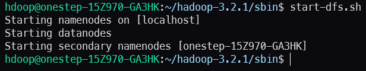
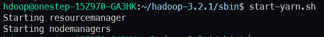
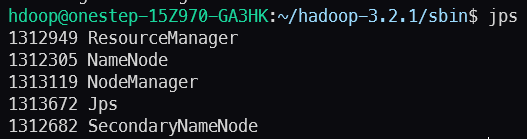
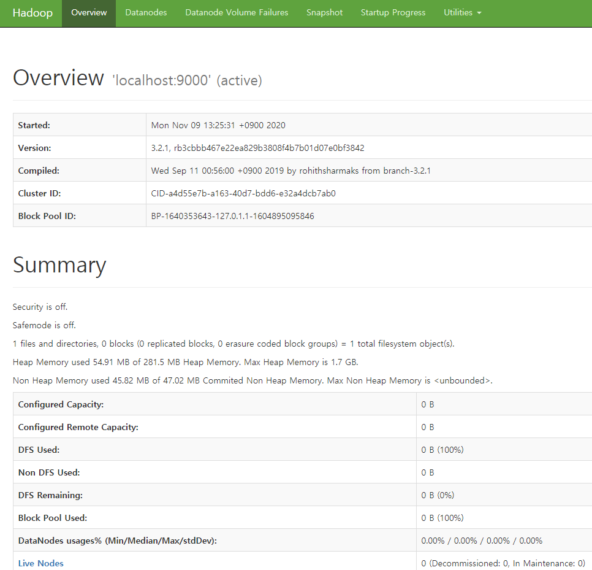

# Hadoop
## 1. Env
* Ubuntu linux 20.04
* Hadoop 3.2.1 (stable)
## 2. Install Sequence
1. Install OpenJDK on Ubuntu
2. Set Up a Non-Root User for Hadoop Environment
3. Download and Install Hadoop on Ubuntu
4. Single Node Hadoop Deployment (Pseudo-Distributed Mode)
## 3. Ref
*  https://hadoop.apache.org/docs/stable/hadoop-project-dist/hadoop-common/SingleCluster.html
* https://phoenixnap.com/kb/install-hadoop-ubuntu<br><br><br>

# Install Sequence
## 1. Install OpenJDK on Ubuntu
```zsh
# Update apt
sudo apt update

# Install open jdk
sudo apt install openjdk-8-jdk -y

# Check installing java has been complete
java -version; javac -version
```


## 2. Set Up a Non-Root User for Hadoop Environment
```zsh
# Install openssh server&client
sudo apt install openssh-server openssh-client -y

# Create non-root user(hdoop) for hadoop
sudo adduser hdoop
sudo usermod -a -G sudo hdoop # add sudo authority
su hdoop

# Enable Passwordless SSH for Hadoop User
ssh-keygen -t rsa -P '' -f ~/.ssh/id_rsa
cat ~/.ssh/id_rsa.pub >> ~/.ssh/authorized_keys

# Change mode so that only owner can read&write 
chmod 0600 ~/.ssh/authorized_keys
ssh localhost
```
## 3. Download and Install Hadoop on Ubuntu From Hadoop Official Web Page

```zsh
# Binary download for Hadoop Version 3.2.1
wget https://downloads.apache.org/hadoop/common/hadoop-3.2.1/hadoop-3.2.1.tar.gz

tar xzf hadoop-3.2.1.tar.gz
```
## 4. Single Node Hadoop Deployment (Pseudo-Distributed Mode)
I will set up pseudo-distributed mode. A Hadoop environment is configure by editing a set of configuration files: <br>
* bashrc
* hadoop-env.sh
* core-site.xml
* hdfs-site.xml
* marped-site.xml
* yarn-site.xml

```zsh
# .bashrc
sudo vi .bashrc

# Hadoop Related Options
# Adding the following content to the end of the file
export HADOOP_HOME=/home/hdoop/hadoop-3.2.1
export HADOOP_INSTALL=$HADOOP_HOME
export HADOOP_MAPRED_HOME=$HADOOP_HOME
export HADOOP_COMMON_HOME=$HADOOP_HOME
export HADOOP_HDFS_HOME=$HADOOP_HOME
export YARN_HOME=$HADOOP_HOME
export HADOOP_COMMON_LIB_NATIVE_DIR=$HADOOP_HOME/lib/native
export PATH=$PATH:$HADOOP_HOME/sbin:$HADOOP_HOME/bin
export HADOOP_OPTS="-Djava.library.path=$HADOOP_HOME/lib/native"
```

```zsh
# hadoop-env.sh
sudo vi $HADOOP_HOME/etc/hadoop/hadoop-env.sh

# Uncomment the $JAVA_HOME variable and add the full path to the OpenJDK installation on your system
export JAVA_HOME=/usr/lib/jvm/java-8-openjdk-amd64

# If you don't know path
which javac
readlink -f /usr/bin/javac
```


```zsh
# core-site.xml File
# To set up Hadoop in a pseudo-distributed mode, you need to specify the URL for your NameNode, and the temporary direction Hadoop Uses for the map and reduce process
sudo vi $HADOOP_HOME/etc/hadoop/core-site.xml

# Add the following configuration to override the default values for the temporary directory and add your HDFS URL to replace the default local file system setting
<configuration>
<property>
    <name>hadoop.tmp.dir</name>
    <value>/home/hdoop/tmpdata</value>
</property>
<property>
    <name>fs.default.name</name>
    <value>hdfs://127.0.0.1:9000</value>
</property>
</configuration>
```

```zsh
# hdfs-site.xml File
# The properties in the hdfs-site.xml file govern the location for storing node metadata, fsimage file, and edit log file. Configure the file by defining the NameNode and DataNode storage directories.

# Additionally, the default dfs.replication value of 3 needs to be changed to 1 to match the single node setup 
sudo vi $HADOOP_HOME/etc/hadoop/hdfs-site.xml

# Add the following configuration to the file and, if needed, adjust the NameNode and DataNode directories to your custom locations
<configuration>
<property>
    <name>dfs.data.dir</name>
    <value>/home/hdoop/dfsdata/namenode</value>
</property>
<property>
    <name>dfs.data.dir</name>
    <value>/home/hdoop/dfsdata/datanode</value>
</property>
<property>
    <name>dfs.replication</name>
    <value>1</value>
</property>
</configuration>
```

```zsh
# marped-site.xml
# The properties in marped-site.xml define MapReduce values
sudo vi $HADOOP_HOME/etc/hadoop/mapred-site.xml

#Add the following configuration to change the default MapReduce framework name value to yarn
<configuration> 
<property> 
    <name>mapreduce.framework.name</name> 
    <value>yarn</value> 
</property> 
</configuration>
```

```zsh
# The yarn-site.xml file is used to define settings relevant to YARN. It contains configurations for the Node Manager, Resource Manager, Containers, and Application Master
sudo vi $HADOOP_HOME/etc/hadoop/yarn-site.xml

# Append following configuretion
<configuration>
<property>
    <name>yarn.nodemanager.aux-services</name>
    <value>mapreduce_shuffle</value>
</property>
<property>
    <name>yarn.nodemanager.aux-services.mapreduce.shuffle.class</name>
    <value>org.apache.hadoop.mapred.ShuffleHandler</value>
</property>
<property>
    <name>yarn.resourcemanager.hostname</name>
    <value>127.0.0.1</value>
</property>
<property>
    <name>yarn.acl.enable</name>
    <value>0</value>
</property>
<property>
    <name>yarn.nodemanager.env-whitelist</name>   
    <value>JAVA_HOME,HADOOP_COMMON_HOME,HADOOP_HDFS_HOME,HADOOP_CONF_DIR,CLASSPATH_PERPEND_DISTCACHE,HADOOP_YARN_HOME,HADOOP_MAPRED_HOME</value>
</property>
</configuration>
```

## 5. Format HDFS NameNode
It is important to format the NameNode before starting Hadoop service for the first time
    
    hdfs namenode -format

## 6. Start Hadoop Cluster
Navigate to the hadoop-3.2.1/sbin directory and execute the following commands to start the NameNode and DataNode
```zsh
./start-dfs.sh
```

```zsh
./start-yarn.sh
```

Type this simple command to check if all the daemons are active and running as Java processes
```zsh
jps
```

## 7. Access Hadoop UI from Browser
The NameNode user interface provides a comprehensive overview of the entire cluster
    
    http://localhost:9870

The default port 9864 is used to access individual DataNodes directly from your browser

    http://localhost:9864


The YARN Resource Manager is accessible on port 8088

    http://localhost:8088